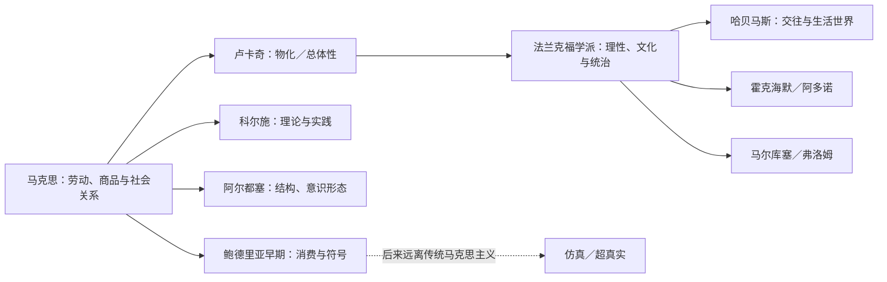
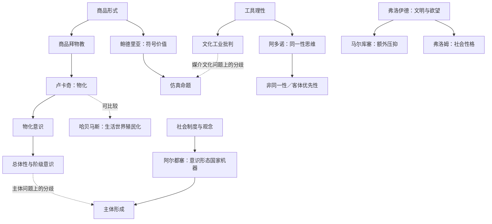

# 西方马克思主义：从零基础到能够答题

**使用范围**：依据《01黄羽学姐西马复习笔记.docx》制作的通用复习讲义；适合每天学习 1 小时。它帮助你理解笔记，但不取代原著、指定教材或目标院校考纲。

**读法**：每天按《西马45天逐日计划.md》阅读指定小节。读完先合上讲义，用自己的话回答“他在批判什么、为什么、提出了什么”，然后做题。不要第一遍就背诵整段文字。

**标记**：`[笔记]` 表示复述原笔记；`[补充]` 表示为理解而加入、已列来源的内容；`[待核]` 表示原笔记说法过强、语境不明或学界有分歧。P 编号是本材料按原 docx 正文顺序建立的定位号，可结合小标题在原文件内搜索。解释尽量采用转述，不把英译文本的措辞误当作唯一中文译法。

## 0. 先把问题看清楚

这份笔记不是九位思想家的名词表。贯穿它的一个问题是：**现代社会由人创造的制度、商品、技术、媒介和符号，为什么会反过来限制人？人怎样理解并改变这种处境？** 各家回答并不相同，甚至相互反对。不能把他们都写成“批判资本主义导致人的异化”。

**概念关系图**（实线表示本讲义重点论证联系，虚线表示可比较但不能直接等同）：

**四条比较线**：①问题从何处产生（商品、理性、心理、交往、结构、符号）；②谁能认识它（阶级、批判理论、主体间交往、理论实践）；③改变靠什么（总体性实践、否定、公共讨论、结构性斗争等）；④理论的边界在哪里。参考卢卡奇、批判理论、哈贝马斯、阿尔都塞及鲍德里亚的学术概述 [R4][R6][R9][R11][R12]。

## 1. 零基础入口：学后面内容之前要懂的 12 个词

| 概念 | 先用白话理解 | 更准确地说／为什么需要 |
|---|---|---|
| 主体／客体 | 谁在认识或行动／他面对的对象 | 主体不等于“个人”，客体也不只是物体；讨论社会时，制度和他人也可能成为行动对象。卢卡奇的“主客体统一”、阿多诺的“客体优先性”都从此出发。[R4][R7] |
| 辩证法 | 不把事物看成静止、互不相干的片段 | 要追问概念或社会关系内部的张力及历史变化。不能把它背成“任何事都有正反两面”，也不能把黑格尔机械压缩成固定三段式。[R1] |
| 实践 | 人在一定条件下改变对象和自身的活动 | 科尔施讨论理论与实践的关系，卢卡奇讨论阶级意识转成行动时，都需要这个词。[R5] |
| 使用价值／交换价值 | 物能满足什么需要／它在交换中有什么价值 | 马克思从商品的双重性分析资本主义生产。鲍德里亚后来又强调商品的“符号价值”；三者不可混同。[R3][R12] |
| 商品拜物教 | 人与人的生产关系看起来像物本身的属性 | 不是“喜欢买东西”，也不只是思想错误；它涉及商品生产中社会关系呈现的客观形式。卢卡奇从这里展开物化。[R3][R4] |
| 异化 | 自己的活动和成果反过来成为陌生、对立的力量 | 马克思在 1844 年手稿中分析异化劳动；后来理论的语境变化不能抹平。[R2][R4] |
| 物化 | 社会关系与人的能力被当作可计算的“物”来处理 | 卢卡奇不仅谈商品，还谈工作、法制、官僚制中的客观结构与被动的观看态度。它与异化有关，但并非同义词。[R4] |
| 总体性 | 从相互联系的历史社会过程理解局部 | 不是“掌握全部知识”或“整体比个人重要”；在卢卡奇那里是反对把关系切碎成孤立事实的认识与实践原则。[R4] |
| 工具理性 | 只问什么手段最有效 | 与“目的是否值得、对谁有利”不同。法兰克福学派批评它变成支配逻辑时的后果，不等于反对一切技术。[R6] |
| 意识形态 | 社会生活中的观念和实践如何塑造对世界的理解 | 各家用法不同；阿尔都塞尤其讨论制度与日常实践怎样把个体塑造成主体，不能只记“虚假观念”。[R11] |
| 理性化／官僚制 | 规则、计算、分工越来越重要 | 是理解卢卡奇的物化和法兰克福学派批判的背景；规则也有协调功能，问题在于它何时压倒具体的人。[R4][R6] |
| 结构／符号 | 关系的位置与规则／承载意义、显示差异的形式 | 阿尔都塞研究结构怎样产生效果；鲍德里亚研究消费和媒介中符号怎样组织差异。两人的“结构”并不等同。[R11][R12] |

**先练两个判断**：①“商品拜物教就是购物成瘾”——错，它关注社会关系怎样以物的关系呈现。②“批判工具理性就是拒绝科学”——错，批判的是把手段计算扩展为唯一标准。详细解析见练习册 B01、B02。

### 三座背景桥

1. **黑格尔→卢卡奇、科尔施、阿多诺。** 黑格尔的辩证法使他们关注对立、否定和整体，但三人的改写不同：卢卡奇突出历史社会总体，科尔施突出理论与实践，阿多诺拒绝用总体概念消除对象差异。[R1][R4][R5][R7]
2. **马克思→大多数章节。** 先懂商品形式、劳动异化和历史社会关系，才看得出后来的“继承”与“改写”；不能因为都谈压迫就断言理论相同。[R2][R3]
3. **弗洛伊德、社会心理学→马尔库塞与弗洛姆。** 二人都借助精神分析，但前者用“额外压抑”理解文明与解放，后者借“社会性格”解释社会与心理的相互作用。把他们都归为“心理决定论”会错。[R8][R10]

---
## 2. 卢卡奇：为什么“人造的关系”像自然规律？

**源文**：P0001—P0155；“商品拜物教与物化现象”“总体性原则”“阶级意识”。**一句话主旨**：卢卡奇把马克思的商品拜物教分析扩展为对资本主义社会中客观结构和人的意识形态的物化批判。[笔记][R3][R4]

**通俗解释**：假设一个平台把骑手的每一步都换成时间、分数和排名。单个骑手觉得规则像天气一样“只能适应”，自己也把能力当成可出售的指标。卢卡奇会追问：这些看似独立的规则其实由怎样的社会关系形成？为什么人只能旁观而不再把它当作可改变的关系？这是**解释性的类比**，不是证明平台必然完全符合卢卡奇理论。

**严格表述与论证**：①商品交换扩大，人的劳动和关系更常以可计算形式出现；②理性化分工使过程拆成片段，人的能力成为可测量、可处置的部分；③制度被体验为独立、自律的“第二自然”，主体倾向于被动适应，这就是物化意识；④只看孤立事实便看不见其历史形成，故须用“总体性”恢复局部与社会关系的连接；⑤卢卡奇把无产阶级的阶级意识视为把自身受物化处境与社会总体联系起来、从而可能采取变革实践的环节。[R4] **这里有强主张**：无产阶级为何能成为历史的统一主体，后来受到很多批评，答题时应呈现为“卢卡奇认为”，不要写成无需论证的事实。

**易混对照**：商品拜物教聚焦商品社会关系的呈现；物化把这一分析扩展到社会组织与意识；异化劳动是马克思关于劳动者同劳动活动、产品等关系的分析；总体性是认识社会关系的原则，不是“无视个体差异”。[R2][R3][R4]

**现实议题**：算法管理可帮助看见“人的能力被数字化”的一面；同时要问谁制定指标、劳动者能否协商、不同平台的制度有何差异，不能以“有数字”就断言发生物化。**答题句式**：“卢卡奇从商品形式的普遍化说明物化如何使社会关系呈现为独立的物的规律，并进一步通过总体性与阶级意识寻找超越被动适应的可能。”

**核查提醒**：[待核] P0004 将卢卡奇物化与马克思异化说成“本质上一致”，适合作为关联线索，不适合作为完全同义的定义；P0013—P0015 关于前资本主义“完全不存在物化”的绝对表述，应限定在卢卡奇论述的现代商品形式普遍化条件下。[R2][R4]

## 3. 科尔施：马克思主义为何不能只剩一套结论？

**源文**：P0156—P0256；“理论的危机与哲学性的丧失”“哲学转折”“发展三阶段论”。**一句话主旨**：科尔施要求把马克思主义理论本身放回历史斗争和实践中理解，反对把它拆成与现实行动脱节的固定科学条文。[笔记][R5]

**通俗解释**：一本“社会问题说明书”若只保留现成答案，却不再追问这些答案产生于什么社会冲突、今天是否仍解释得通，就失去了批判能力。科尔施会说，理论自身也有历史，不能站在历史之外假装永远不变。

**严格表述与论证**：①把马克思主义的哲学维度单纯排除，会削弱其批判资本主义社会总体的能力；②马克思主义的理论概念不是中立资料库，它同一定历史实践相联系；③讨论“消灭／扬弃哲学”时，关键不是删掉哲学这个学科名，而是改变哲学与现实社会关系的关系；④因此，需要考察马克思主义自己的历史变化和理论实践的统一。[R5] 笔记提出的“三阶段”可用于复习，但划分标准须跟具体文本一起说明，不能机械当作所有史家的统一分期。

**易混对照**：理论联系实践不等于“理论只需立即有用”；扬弃哲学不等于禁止哲学思考；总体性也不等于把政治、经济、文化抹成一个因素。[R5]

**现实议题**：分析平台劳动时，如果只背“剥削”结论而不调查劳动形式、收入机制和组织可能性，就容易使批判变成口号。此例说明科尔施问题意识，不能直接推出某平台的性质。**答题句式**：“科尔施把马克思主义的理论形态及其变迁视为社会历史的一部分，主张在理论与实践的辩证统一中恢复其批判能力。”

**核查提醒**：[待核] P0179、P0187 等处“哲学性的丧失／恢复”是笔记的概括，答题宜落到《马克思主义与哲学》所讨论的理论和实践关系；“三阶段论”参见原文语境后再使用。[R5]

## 4. 霍克海默与《启蒙辩证法》：理性为何会反过来支配人？

**源文**：P0257—P0394；“传统理论和批判理论”“启蒙辩证法”“文化工业”。**一句话主旨**：霍克海默要求理论反思其社会条件与解放目标；他与阿多诺合著的《启蒙辩证法》追问理性怎样可能退化成支配自然和人的计算工具。[笔记][R6]

**通俗解释**：如果评判一所学校只剩录取率、报表和流量，原本为了帮助人成长的制度可能开始逼迫所有人适应指标。但批判不是说统计数据都坏，而是问：指标服务什么目的？被指标忽略的人和经验在哪里？

**严格表述与论证**：①“传统理论”常把研究者与社会对象分开，容易忽略知识生产本身的历史和社会条件；②“批判理论”既研究事实，也反思这些事实所处的社会关系和人的解放可能；③在《启蒙辩证法》中，启蒙试图摆脱神话和恐惧，但当理性被压缩为可计算、可支配的手段，可能产生新的不自由；④“文化工业”分析文化产品如何在标准化生产和市场机制下，影响趣味、欲望与批判能力。[R6][R7]

**易混对照**：工具理性不是理性全部；文化工业不是“大众文化”这一价值中性的总称；霍克海默的“批判理论”与阿多诺的《否定辩证法》也不能互换作者。[R6][R7]

**现实议题**：以短视频推荐为例，可以问内容生产受哪些流量激励、观众是否仍有选择和批评空间；不能只因内容通俗就断言它“洗脑”。**答题句式**：“霍克海默将理论置于社会历史关系中反思；《启蒙辩证法》则说明，以控制为目的的理性和标准化文化生产如何可能削弱主体的批判能力。”

**核查提醒**：[待核] P0257 附近将“否定辩证法”与霍克海默紧邻叙述，容易误认作者；《否定辩证法》是阿多诺的著作，《启蒙辩证法》由霍克海默与阿多诺合著。[R6][R7]

---
## 5. 阿多诺：概念为什么总有说不尽的对象？

**源文**：P0395—P0501；“否定的辩证法”“客体的优先性”“奥斯维辛之后”“艺术作品中的真理内容”。**一句话主旨**：阿多诺用“非同一性”提醒我们：概念虽不可缺少，却不能把具体对象完全消化掉。[笔记][R7]

**通俗解释**：把同学全称为“绩点 3.8 的人”，能够快速分类，却说不尽他的经验、需要和遭遇。阿多诺不是要丢掉概念，而是要用概念发现其自身遗漏了什么。

**严格表述与论证**：①认识必须运用概念，概念却倾向于把不同对象纳入同一类别；②交换和管理中的等价化可能强化这种思维；③“否定辩证法”从对象与概念的不吻合处展开确定的批判，拒绝用一个正面总体终结差异；④“客体优先性”提醒认识不能把对象当作主体任意构造的产物；⑤关于奥斯维辛的思考使他警惕把苦难轻易纳入进步故事；艺术的真理内容也与作品对既有现实的否定关系有关。[R7]

**易混对照**：非同一性不等于“所有概念都错”；客体优先性不等于取消主体；否定辩证法不等于逢事说“不”。[R7]

**现实议题**：用单一分数评价教育、劳动或医疗服务时，可追问被平均数遗漏的差异；但评价制度有时也提供必要的公共比较，不能只因使用分类就判定其不正当。**答题句式**：“阿多诺通过非同一性和客体优先性，批评同一性思维对具体对象的压平，同时坚持借助概念的自我批判揭示对象尚未被表达的方面。”

**核查提醒**：[待核] P0467—P0471 等关于文化、死亡的强烈表达须放回“奥斯维辛之后”的历史语境；不宜用激烈句子代替论证。[R7]

## 6. 马尔库塞：为什么需要分清“必要限制”和“额外压抑”？

**源文**：P0502—P0609；“爱欲与文明”“单向度”“否定向度”。**一句话主旨**：马尔库塞结合马克思和弗洛伊德，分析社会组织如何把本可改变的压抑和需要表现成必然，并寻找想象不同生活的能力。[笔记][R8]

**通俗解释**：人们共同生活，不能每个冲动都立刻满足；这是必要限制。但如果一个制度要求人持续接受超出共同生活所需的服从，却把它说成“人生本来如此”，马尔库塞会追问这种额外限制服务谁。

**严格表述与论证**：①弗洛伊德帮助描述文明和欲望的紧张；②马尔库塞区分维持共同生活所需的基本压抑与服务于特定支配关系的额外压抑；③在发达工业社会，消费和行政管理还可能把人的愿望导向维持现存秩序的需要；④“单向度”指批判和否定现存生活方式的维度被削弱；⑤艺术、想象和新的需要为反思打开空间，但不能自动等同政治方案。[R8]

**易混对照**：基本压抑≠额外压抑；真实需要／虚假需要不是由旁观者随意替别人判定；单向度不是“人人只会一种想法”。[R8]

**现实议题**：讨论“为了效率必须全天在线”时，先分辨确有协作需要的部分和可协商的劳动制度；不能仅凭个人疲惫就证明制度具有额外压抑。**答题句式**：“马尔库塞借额外压抑分析历史性的支配如何被自然化，又以单向度批判说明发达工业社会怎样吸收反对力量、缩小对另一种生活的想象。”

**核查提醒**：[待核] P0560“许多无意义的劳动，目的是控制人”带有目的归因；现实应用必须另找证据，不能把理论判断直接当具体社会事实。[R8]

## 7. 弗洛姆：社会如何进入人的性格？

**源文**：P0610—P0748；“马克思与弗洛伊德”“社会性格”“逃避自由”；图 1。**一句话主旨**：弗洛姆借社会性格解释社会条件与心理需求如何相互作用，并分析自由可能同时带来不安与逃避的冲动。[笔记][R9]

**通俗解释**：一个人可能真正想“做自己”，又害怕离开熟悉群体后失去方向，于是更愿意遵从流行标准。弗洛姆关心的不只是这个人的私人性格，还关心什么样的社会生活使这种倾向广泛出现。

**严格表述与论证**：①社会的经济和生活条件塑造经常出现的性格倾向；②这种“社会性格”又影响人们怎样工作、相信什么、服从或反抗什么；③个体从传统束缚中脱离，获得某种消极自由，也可能感到孤独和无力；④权威主义、破坏性、机械趋同等可成为逃避不安的方式；⑤积极自由关注有能力自主行动、爱与创造的生活，而不是单纯取消外在约束。[R9]

**易混对照**：社会性格不是给整个民族贴单一人格标签；逃避自由不是“不喜欢自由”；弗洛姆的社会心理分析不是临床诊断，也不能替代对具体人的心理评估。[R9]

**现实议题**：在社交平台跟随流行表达可用“机械趋同”提出问题，但一次跟风行为不足以判断人格，更不能把社会问题归咎于个人“性格有病”。**答题句式**：“弗洛姆通过社会性格连接经济结构与观念心理，说明个体获得摆脱旧束缚的自由后，仍可能因孤独和无力感而以顺从方式逃避自由。”

**图 1 文字版**：原图显示“思想和理想 ↔ 社会性格 ↔ 经济基础”三个层次。它提示双向影响；严谨表达应为：经济与社会生活条件影响社会性格，社会性格又参与观念形成及社会再生产。图上的箭头只是讲解简图，不能据此推出各方向作用完全等强。[R9]

**核查提醒**：[待核] P0654—P0681 中“精神病学”类比不宜用于现实个体的诊断；笔记中的马克思与弗洛伊德“相同点”是比较框架，不意味着二人对象和方法相同。[R9]

---
## 8. 哈贝马斯：怎样把“说得通”与“管得快”分开？

**源文**：P0749—P0895；“交往行动”“生活世界”“系统整合”“合法化危机”；图 2。**一句话主旨**：哈贝马斯把相互理解的交往视为社会协调的重要资源，并批判市场与行政系统越过适当边界、挤压需要共同讨论的生活领域。[笔记][R10]

**通俗解释**：小组决定去哪实习，可以通过讨论理由达成理解，也可以只按“谁排名高谁说了算”。后者可能快，但无法回答规则本身是否合理。哈贝马斯关心这种“能否给出可接受的理由”的能力。

**严格表述与论证**：①交往行动以达成理解为取向，区别于主要追求行动成功的策略行动；②言语交往中可被质疑的基本有效性要求包括事实是否真实、规范是否正当、表达是否真诚；③语言和日常共同理解维持“生活世界”；④现代社会又发展出借货币、权力等媒介运行的系统，能高效处理复杂事务；⑤当系统机制进入本需通过共同理解协调的领域并压倒它，才谈“生活世界殖民化”；⑥合法化危机与公共领域问题要放进具体制度语境讨论。[R10]

**易混对照**：事实的**真理性**对应客观世界，规范的**正当性**对应社会世界，表达的**真诚性**对应主观世界；这不是把每一种行动和一个世界机械配对。系统分化本身不等于殖民化，货币与行政协调也并非一无是处。[R10]

**现实议题**：大学若只以点击量决定课程，可能使关于教育目标的讨论让位于可量化指标；但数字指标也可提供信息。分析要问是否仍有师生参与、申诉与公开论证的空间。**答题句式**：“哈贝马斯从交往行动中的可批评有效性要求说明主体间理解如何可能，并用系统与生活世界的区分诊断市场和行政逻辑越界时的社会病理。”

**图 2 文字版**：原图手写展示“生活世界”与客观、社会、主观三个世界的关联，中部一些字迹难辨。可用于学习的可靠版本是：交往参与者围绕客观事实、社会规范及主观经验提出并检验主张；不可把图上的 A1、A2、箭头逐个硬译为理论定式。[R10]

**核查提醒**：[待核] P0782—P0784 将“客观世界：正确性／策略行动”等并列，容易混淆世界关系、有效性要求、行动类型；应按上面的三组区分重记。[R10]

## 9. 鲍德里亚：消费为何还在购买“意义”？

**源文**：P0896—P1095；“符号的结构意义”“生产的终结”“政治的终结”“仿真”。**一句话主旨**：鲍德里亚早期从消费的符号价值扩展马克思的商品分析，后来越来越质疑以生产、阶级和现实／表象区分来解释媒介社会的传统框架。[笔记][R12]

**通俗解释**：两只功能相近的包，价格可能差很多；买家也在购买品牌带来的区分与身份意味。鲍德里亚会把这些差异当作消费社会的组成部分，而不只看物的实际用途。

**严格表述与论证**：①商品除使用价值、交换价值外还可能承担表示地位和差异的符号价值；②广告、媒介和消费体系把需求组织为差异关系；③其后期“仿真”分析探讨符号和模型如何先行组织人们经验的现实；④“生产的终结”“政治的终结”是带有强烈理论立场的命题，不能按字面理解为工厂、劳动或政治活动消失。[R12] **位置提醒**：鲍德里亚的思想历程包含对马克思的继承与批判，后期通常归入后现代／后结构主义讨论；把他无条件算作典型“西方马克思主义者”有争议。[R12]

**补一层：媒介与“内爆”**。笔记后半谈政治、时尚、社会性与意义的“终结”。在鲍德里亚那里，“内爆”意指原本可区分的政治、经济、文化和媒介经验相互挤压、边界变弱；这仍是他的时代诊断。分析网络传播时，可借它提问“信息量增加是否反而使重要差异难以辨认”，但不能把任何信息过载都直接判为内爆，更不能由此断言现实社会关系消失。[R12]

**易混对照**：符号价值不等于交换价值；仿真不等于“所有东西都是假的”；“内爆”是他对媒介社会区分坍缩的分析术语，不等于物理学现象。[R12]

**现实议题**：某品牌联名突然走红，可以问产品功能、稀缺性、群体身份和传播机制怎样共同作用；不能只用“符号价值”就解释销量的全部变化。**答题句式**：“鲍德里亚从商品的符号价值分析消费差异，后期则以仿真等概念质疑传统生产中心论；其与马克思主义既有关联，也存在明显分歧。”

**核查提醒**：[待核] P0964“生产的终结和西方金融危机”等现实判断缺乏时间、对象和证据，不能直接背成经验事实；P0984、P1039、P1059 的多个“终结”说法都要当作作者命题而非日常事实。[R12]

## 10. 阿尔都塞：为什么读文本还要注意它“看不见”的东西？

**源文**：P1096—P1225；“症候阅读”“问题框架”“意识形态国家机器”“认识论断裂”；图 3。**一句话主旨**：阿尔都塞通过文本中的空白和矛盾寻找理论的“问题框架”，并用结构、意识形态与主体形成来重读马克思。[笔记][R11]

**通俗解释**：一份调查问卷只问“你愿意每周加班几小时”，从不问“加班制度是否合理”。答案再多，也不会自动产生第二个问题。阿尔都塞式阅读会注意调查的提问方式怎样决定了哪些答案能出现。

**严格表述与论证**：①文本不只是显露的句子，也受一套可提问／不可提问的理论框架制约；②“症候阅读”从矛盾、空白和概念转换处辨认框架；③阿尔都塞用“认识论断裂”描述马克思思想从早期问题框架向历史唯物主义的变化，但断裂的时间和程度一直有争议；④意识形态不是附在现实之外的一层谎话，它通过学校、家庭等制度实践和“召唤”机制参与主体形成；⑤结构的各层次具有相对自主性，不能把政治、文化直接化约为经济的机械结果。[R11]

**补一层：结构因果性**。笔记 P1192—P1225 还讨论总体性和历史。阿尔都塞反对用一个隐藏“本质”解释所有部分，也反对经济单向、机械地造成所有观念；他把社会看作由多种相互作用、发展并不齐整的实践组成的复杂结构。所谓“结构因果性”，就是分析结构通过其要素间关系发挥作用。入门先记“多种实践有各自机制，不能只用一个原因包打天下”，再回头读术语。[R11]

**易混对照**：症候阅读不是任意猜作者“潜台词”；认识论断裂不是一夜之间把前期著作全部作废；“理论上的反人道主义”针对把抽象人性当社会科学的起点，并不等于赞成残酷对待人。[R11]

**现实议题**：分析招聘系统的问卷，可以比较它问了什么、没问什么、谁设定标准；但“没有问到”不必然证明故意操控，需要制度背景证据。**答题句式**：“阿尔都塞通过问题框架与症候阅读揭示文本的理论条件，又通过意识形态国家机器和主体召唤说明社会关系如何在日常制度实践中再生产。”

**图 3 文字版**：图上 A、B、C 是时间轴上不同研究位置，D 被圈作“我们研究的认识对象”，旁边注明研究不同结构及其关系。可保留的学习要点是“研究对象不是直接照相式复制当下经验，而要通过概念建构并分析多种结构的关系”。图中的 A—D 具体对应没有图注，不应猜测。[R11]

**核查提醒**：[待核] P1188 的“理论上的反人道主义”必须交代它针对哪类理论方法；P1184 的“断裂”是阿尔都塞的解释主张，其他马克思研究者对此有不同看法，而且阿尔都塞本人后期也修订过部分早期立场。[R11]

---
## 11. 三组最容易混淆的比较

| 问题 | A | B | 答题时的区别 |
|---|---|---|---|
| 社会关系怎样遮蔽人？ | 卢卡奇：商品形式普遍化造成物化和被动意识 | 哈贝马斯：系统媒介越界侵入需交往协调的生活世界 | 哈贝马斯是在改写物化诊断，不能把“合理化”本身判为病因。[R4][R10] |
| 批判为何不能停在概念？ | 科尔施：理论须与历史实践相连 | 阿多诺：概念须承认对象的非同一性 | 前者重理论的历史实践位置，后者重概念与对象的张力。[R5][R7] |
| 为什么人会配合现存秩序？ | 马尔库塞：需要和压抑被社会组织 | 弗洛姆：社会性格与逃避自由 | 一人突出欲望、需要与发达工业社会，另一人突出社会心理的形成机制。[R8][R9] |
| 主体从何而来？ | 卢卡奇：阶级意识使历史主体的实践成为可能 | 阿尔都塞：意识形态与结构参与塑造主体 | 不可把“主体”当成各家共享的同一概念。[R4][R11] |
| 文化批判的焦点 | 霍克海默／阿多诺：文化工业的标准化 | 鲍德里亚：消费中的符号差异与仿真 | 前者分析文化生产与支配，后者更强调符号体系及其后期理论转向。[R6][R12] |

## 12. 用理论观察当代社会：六个练习场景

这些是**解释框架**，不声称已经完成社会调查。每看一个案例，先写可观察事实，再写理论解释，最后写一个可能反证。

| 场景 | 可以这样提问 | 还需要什么证据／边界 |
|---|---|---|
| 外卖平台的计时与评分 | 卢卡奇：劳动者是否被当作可替换的数字？哈贝马斯：有关规则的协商空间是否被系统效率挤压？ | 需了解算法规则、工人经验、收入、申诉与协商机制；数字化本身不等于物化。 |
| 短视频平台的推荐 | 文化工业：内容是否趋于标准化？马尔库塞：满足的需要是否削弱批判？ | 观察创作者激励、受众差异和实际使用；娱乐也可能有创造和学习价值。 |
| 品牌联名与限量款 | 鲍德里亚：身份差异怎样成为商品意义？马克思：商品的使用、交换关系是什么？ | 价格、品质、生产条件、群体解释都影响消费，不能只归因于符号。 |
| 学校或公司的指标管理 | 阿多诺：标准遗漏什么具体经验？霍克海默：计算服务的目的是否被反思？ | 指标可能增加透明度；需比较评价前后制度和各方反馈。 |
| 网络公共讨论 | 哈贝马斯：事实、规范、真诚分别在哪被质疑？鲍德里亚：媒介形式怎样改变可见性？ | 注意平台设计和言论环境；不把不同意见本身当作讨论失败。 |
| AI 生成内容与学习 | 科尔施：知识是否从实践中脱离？阿尔都塞：提问框架预设了哪些可见答案？ | 要检查材料来源、知识产权、使用场景与实际学习效果；理论不能替代这些调查。 |

**作答模板**（只作骨架，不代替具体分析）：

> 某理论的核心问题是____。它把____理解为____，其论证可分为____、____、____。在____现象中，这一理论有助于我们追问____；但仅凭这个案例不能证明____，还需要____。与____相比，该理论更强调____。

## 13. 原笔记重点核查记录

| 原文位置 | 原笔记的学习线索 | 本讲义的处理 |
|---|---|---|
| P0004、P0027 | 卢卡奇物化与马克思异化“本质上一致” | 保留联系，改用“相关但不同层次、不同问题设置”；比较《1844 年手稿》《资本论》和卢卡奇。[R2][R3][R4] |
| P0012—P0015 | 前资本主义“没有物化” | 限定为“卢卡奇讨论的现代商品形式普遍化的物化”；避免跨时代绝对断言。[R4] |
| P0085 | 总体性原则“高于经济原则” | 作为卢卡奇在特定论辩中的表述，避免推广为所有马克思主义者共识。[R4] |
| P0187—P0225 | “哲学转折”“消灭哲学” | 结合科尔施原文理解为哲学与社会现实关系的改造，避免字面化。[R5] |
| P0262—P0264 | 否定辩证法紧邻霍克海默 | 区分学派共同倾向、霍克海默的批判理论、阿多诺的同名著作。[R6][R7] |
| P0269—P0270 | 传统理论≈实证主义、批判理论≈辩证法 | 作为入门对照有帮助，但过于整齐；补上理论的社会位置和解放旨趣。[R6] |
| P0342—P0370 | 文化工业与大众文化 | 不把一切通俗文化都说成文化工业；关注标准化生产及社会功能。[R6] |
| P0502—P0540 | 文明与压抑 | 区分基本压抑和额外压抑；后者是社会历史判断。[R8] |
| P0654—P0681 | 异化与精神病学类比 | 仅作思想史比较，不作现实人物的诊断术语。[R9] |
| P0782—P0785 | 客观世界写“正确性／策略行动” | 纠正为事实真理性、规范正当性、表达真诚性；不与行动类型硬配。[R10] |
| P0804—P0824 | 系统与生活世界 | 补上“系统分化有协调功能；殖民化才是特定问题”。[R10] |
| P0964、P0984、P1039 | 生产、政治、社会性“终结” | 标明鲍德里亚的理论命题，不当作生产或政治在经验世界中消失。[R12] |
| P0997 | 把政治犬儒主义解释为“像狗一样” | 不采纳这一字面化、贬义化解释；若考试需要，先明确“犬儒主义”所指的怀疑与疏离态度。 |
| P1001、P1010 | “猴子在投票”“媒介就是信息” | 前者是情绪性课堂笔记，不能当理论定义；后者与麦克卢汉“媒介即讯息”的表述需区分，不归为鲍德里亚原话。[R13] |
| P1178—P1179 | 个人完全被动；自行思考就“病态” | 这是过度推论；阿尔都塞讨论主体形成的结构条件，并非给个体思想独立性作医学诊断。[R11] |
| P1183—P1184 | 把哈贝马斯公共领域、葛兰西文化领导权并列进意识形态国家机器 | 三种理论有可比较处，但概念和问题不同；不能列成同一概念的例项。[R10][R11] |
| P1185—P1191 | 认识论断裂、理论上的反人道主义 | 明确为阿尔都塞的解释，并交代他后期对若干早期论断的修订。[R11] |

## 14. 参考来源与查证边界

原笔记没有在每处标出引文出处，因此上面的“核查”是对**笔记可识别的理论主张**进行交叉比对，不保证还原课堂讲授的完整语境。以下来源可点击；原著英译页帮助核对思想线索，中文考试表述仍要按目标教材校对。访问日期：2026-10-04。

- [R1] [Stanford Encyclopedia of Philosophy：Hegel’s Dialectics](https://plato.stanford.edu/entries/hegel-dialectics/)（学术概述）。
- [R2] [马克思：《1844 年经济学哲学手稿》“异化劳动”英译](https://www.marxists.org/archive/marx/works/1844/manuscripts/labour.htm)（原著英译）。
- [R3] [马克思：《资本论》第一卷第一章英译](https://www.marxists.org/archive/marx/works/1867-c1/ch01.htm)（原著英译）。
- [R4] [Stanford Encyclopedia of Philosophy：Georg Lukács](https://plato.stanford.edu/entries/lukacs/)（学术概述）。
- [R5] [科尔施：《马克思主义与哲学》英译](https://www.marxists.org/archive/korsch/1923/marxism-philosophy.htm)（原著英译）。
- [R6] [Stanford Encyclopedia of Philosophy：Critical Theory](https://plato.stanford.edu/entries/critical-theory/)（学术概述）。
- [R7] [Stanford Encyclopedia of Philosophy：Theodor W. Adorno](https://plato.stanford.edu/entries/adorno/)（学术概述）。
- [R8] [Stanford Encyclopedia of Philosophy：Herbert Marcuse](https://plato.stanford.edu/entries/marcuse/)（学术概述）。
- [R9] [弗洛姆：“Character and the Social Process”英译](https://www.marxists.org/reference/subject/philosophy/works/ge/fromm.htm)（原著节选）；[“Marxism, Psychoanalysis and Reality”英译](https://www.marxists.org/archive/fromm/works/1966/psychoanalysis.htm)（原著）。
- [R10] [Stanford Encyclopedia of Philosophy：Jürgen Habermas](https://plato.stanford.edu/entries/habermas/)（学术概述）。
- [R11] [Stanford Encyclopedia of Philosophy：Louis Althusser](https://plato.stanford.edu/entries/althusser/)（学术概述）。
- [R12] [Stanford Encyclopedia of Philosophy：Jean Baudrillard](https://plato.stanford.edu/entries/baudrillard/)（学术概述）。
- [R13] [The Estate of Marshall McLuhan：关于“the medium is the message”的说明](https://marshallmcluhan.org/common-questions/)（原作者遗产机构的说明）。
